## Background

Food waste is a significant problem on college campuses. Every semester, countless campus events end with trays of untouched food destined for the trash. Meanwhile, students struggle with food insecurity and the high cost of meals. This disconnect between surplus food and hungry students was the inspiration behind **Spark Bytes**.

The project started when we noticed the amount of perfectly good food being discarded after campus events at Boston University. Event organizers often over-order food to ensure they don't run short, but this leads to significant waste. Students, on the other hand, are always looking for affordable meal options.

**Spark Bytes** was born from a simple idea: what if we could create a platform that connects event organizers with leftover food to students who need it? This would not only help reduce food waste but also support students facing food insecurity while promoting sustainability on campus.

Built with **Django**, **Auth0**, and **Google Maps API**, Spark Bytes provides a production-ready solution that makes it easy for organizers to post events with available food and for students to discover and reserve spots at these events.

## Project Overview

**Spark Bytes** is a full-stack web application designed for Boston University students and faculty to post and discover events that offer free food or snacks. The platform serves a dual purpose: minimizing food waste by making surplus food from events more accessible to the BU community, and helping students find affordable meal options.

### The Problem It Solves

Traditional methods of distributing leftover food from events face several challenges:

- **Lack of Visibility**: Students don't know when or where leftover food is available
- **No Reservation System**: First-come-first-served leads to uncertainty and wasted trips
- **Food Safety Concerns**: No way to track what food is available and when
- **Accessibility Issues**: No centralized platform for discovering food events
- **Waste Tracking**: No metrics on food waste reduction

Spark Bytes addresses these issues by providing:

- **Centralized Event Discovery**: Browse all available food events in one place
- **Reservation System**: Reserve spots with capacity limits to ensure availability
- **QR Code Check-ins**: Secure, contactless check-in system for event attendance
- **Interactive Maps**: Visual discovery of nearby events with distance calculations
- **Rich Event Details**: Food types, allergy information, and dietary options
- **Email Confirmations**: Automated emails with QR codes for easy check-in

---

## Technical Architecture

Spark Bytes follows a clean Django-based architecture that separates concerns and enables scalable growth.

### System Architecture

```mermaid
graph TB
    subgraph Client["Client Layer"]
        Browser[Web Browser]
        Templates[Django Templates<br/>HTML/CSS/JS]
    end
    
    subgraph Backend["Backend Layer"]
        Django[Django Framework<br/>Python 3.10<br/>Port 8000]
        Models[Models Layer<br/>Profile & Event]
        Views[Views Layer<br/>Class-Based Views]
        Forms[Forms Layer<br/>Validation]
    end
    
    subgraph Auth["Authentication Layer"]
        Auth0[Auth0 SPA SDK<br/>OAuth 2.0]
        DjangoAuth[Django Auth<br/>Traditional Login]
    end
    
    subgraph Services["External Services"]
        Gmail[Gmail SMTP<br/>Email Service]
        GoogleMaps[Google Maps API<br/>Geolocation]
    end
    
    subgraph Storage["Storage Layer"]
        SQLite[SQLite Database]
        Media[Media Storage<br/>Images & Files]
        Static[Static Files<br/>WhiteNoise]
    end
    
    Browser -->|HTTP Requests| Templates
    Templates -->|Template Rendering| Django
    Django -->|Data Operations| Models
    Django -->|Business Logic| Views
    Views -->|Form Validation| Forms
    Browser -->|OAuth Flow| Auth0
    Auth0 -->|User Info| Django
    Views -->|Email Sending| Gmail
    Templates -->|Map Rendering| GoogleMaps
    Models -->|Persistence| SQLite
    Views -->|File Uploads| Media
    Django -->|Static Assets| Static
    
    style Django fill:#092e20
    style Auth0 fill:#eb5424
    style GoogleMaps fill:#4285f4
    style SQLite fill:#003b57
```



### Service Responsibilities

#### 1. Django Backend (Core Layer)
- **Technology**: Django 3.2.5 + Python 3.10
- **Responsibilities**:
  - RESTful API endpoints for all operations
  - User authentication and authorization
  - Event CRUD operations
  - Reservation management
  - QR code generation
  - Email sending with attachments
  - File upload handling (images)
  - Database operations and migrations

#### 2. Django Templates (Presentation Layer)
- **Technology**: Django Template Language + HTML/CSS/JavaScript
- **Responsibilities**:
  - Server-side rendered UI
  - Event listing and detail pages
  - User profile management
  - Search and filtering interface
  - Interactive map integration
  - Responsive design for mobile and desktop

#### 3. Auth0 Integration (Authentication Layer)
- **Technology**: Auth0 SPA SDK v2.1.3
- **Responsibilities**:
  - OAuth 2.0 authentication flow
  - Third-party login (Google, Facebook, etc.)
  - User profile synchronization
  - Secure token management
  - Session handling

#### 4. Google Maps API (Mapping Service)
- **Technology**: Google Maps JavaScript API
- **Responsibilities**:
  - Interactive map rendering
  - Event marker placement
  - User geolocation
  - Distance calculations
  - Route visualization

### Technology Stack

**Backend:**
- Django 3.2.5 with Python 3.10
- Django REST Framework patterns (class-based views)
- SQLite database (development) / PostgreSQL (production ready)
- WhiteNoise for static file serving
- Gunicorn for production WSGI server

**Frontend:**
- Django Template Language
- Custom CSS for styling
- Vanilla JavaScript for interactivity
- Google Maps JavaScript API
- Auth0 SPA SDK for authentication

**Authentication:**
- Django's built-in authentication system
- Auth0 for OAuth 2.0 third-party login
- Session-based authentication
- CSRF protection

**External Services:**
- Gmail SMTP for email delivery
- Google Maps API for geolocation
- Auth0 for identity management

**Infrastructure:**
- Self-hosted server deployment (spark-bytes.shangmin.me)
- WhiteNoise for static file handling
- Environment variables for configuration
- Docker-ready architecture

---

## Key Features & Capabilities

### Dual Authentication System

Spark Bytes supports two authentication methods, providing flexibility for different user preferences:

**1. Traditional Email/Password Authentication:**
- Custom user registration with email verification
- Boston University ID (BUID) requirement
- Profile picture upload
- Secure password hashing with Django's built-in system

**2. Auth0 OAuth Integration:**
- One-click login with Google, Facebook, or other providers
- Seamless user experience
- Automatic profile synchronization
- Secure token management

**Benefits:**
- Reduced friction for new users (OAuth)
- Flexibility for users who prefer traditional accounts
- Enhanced security with Auth0's enterprise-grade infrastructure
- Support for multiple identity providers

### Rich Event Posting

Event organizers can create detailed event posts with comprehensive information:

**Event Details:**
- Event name and description
- Date and time
- Location with address
- Event image upload
- Reservation limits (default: 50 spots)

**Food Information:**
- **18 Food Type Categories**: Italian, Mediterranean, Salad, American, BBQ, Chinese, Korean, Japanese, Mexican, Spanish, Indian, Thai, Vietnamese, Sushi, Breakfast, Lunch, Vegan, Vegetarian
- **8 Allergy Warnings**: Dairy, Soy, Nuts, Fish, Shellfish, Eggs, Wheat, Sesame
- Custom food items list
- Dietary restriction information

**Use Cases:**
- Academic department events
- Student organization meetings
- Campus-wide celebrations
- Workshop and seminar leftovers
- Conference catering surplus

### Advanced Event Discovery

Students can discover events through multiple methods:

**1. Search and Filter:**
- Search by event name
- Filter by location
- Filter by date
- Multi-select food type filtering
- Multi-select allergy filtering
- Combined search criteria

**2. Interactive Map View:**
- Visual map of all events
- User location detection
- Distance calculations (kilometers)
- Click markers for event details
- Direct links to event pages
- Event images in map popups

**3. Event List View:**
- Chronological listing
- Event images and descriptions
- Quick reservation access
- Creator profile links
- Availability status

### QR Code Check-In System

One of Spark Bytes' standout features is the **QR code check-in system**:

**How It Works:**
1. User reserves a spot for an event
2. System generates unique QR code (email + event ID)
3. QR code sent via email as inline image attachment
4. User presents QR code at event for check-in
5. Organizer scans QR code to verify attendance

**QR Code Features:**
- Unique per user-event combination
- Base64-encoded PNG format
- Embedded in email as inline image
- High error correction (7% recovery)
- Optimized size for email delivery

**Benefits:**
- Contactless check-in process
- Prevents duplicate reservations
- Easy verification for organizers
- Reduces wait times at events
- Professional appearance

### Reservation Management

The reservation system includes several important features:

**Capacity Management:**
- Configurable reservation limits per event
- Real-time availability tracking
- "Event Full" status when limit reached
- Prevents over-booking

**Reservation Tracking:**
- Many-to-many relationship (users ↔ events)
- Prevents duplicate reservations
- Tracks reservation count
- User reservation history

**Email Confirmations:**
- Automatic email upon reservation
- QR code included as attachment
- Event details in email body
- Professional HTML email template

---

## Technical Deep Dive

### QR Code Generation Implementation

QR code generation is implemented as a stateless utility function that creates unique codes for each user-event combination.

**Implementation:**

```python
import qrcode
from io import BytesIO
import base64

def generate_qr_code(data):
    """
    Generates a QR code for the provided data and returns it as a base64-encoded string.
    """
    # Create QRCode object with optimized parameters
    qr = qrcode.QRCode(
        version=1,  # Smallest size for efficiency
        error_correction=qrcode.constants.ERROR_CORRECT_L,  # 7% recovery
        box_size=10,  # Grid size
        border=4,  # Border width
    )
    qr.add_data(data)  # Encode user email + event ID
    qr.make(fit=True)
    
    # Generate image
    img = qr.make_image(fill_color="black", back_color="white")
    buffered = BytesIO()
    img.save(buffered, format="PNG")
    
    # Return base64 string for email embedding
    return base64.b64encode(buffered.getvalue()).decode("utf-8")
```

**Key Design Decisions:**
- **Stateless Generation**: No database storage needed, generated on-demand
- **Unique Data**: Combines user email and event ID for uniqueness
- **Base64 Encoding**: Enables direct email embedding without file storage
- **Optimized Size**: Version 1 QR code for faster generation and smaller size
- **Error Correction**: Level L provides 7% recovery for minor damage

### Email Sending with Attachments

The email system sends HTML emails with inline QR code images:

**Implementation:**

```python
from django.core.mail import EmailMultiAlternatives
from django.template.loader import render_to_string
from email.mime.image import MIMEImage
import base64

def _send_reservation_email(self, event, profile, qr_code_data):
    """
    Sends confirmation email with QR code attachment.
    """
    # Render HTML template
    html_content = render_to_string('spark_bytes/email/qr_code_email.html', {
        'event': event,
        'profile': profile,
    })
    text_content = strip_tags(html_content)
    
    # Create email
    email = EmailMultiAlternatives(
        subject=f'Reservation Confirmation: {event.name}',
        body=text_content,
        from_email=settings.DEFAULT_FROM_EMAIL,
        to=[profile.user.email]
    )
    email.attach_alternative(html_content, "text/html")
    
    # Attach QR code as inline image
    qr_image_data = base64.b64decode(qr_code_data)
    qr_image = MIMEImage(qr_image_data)
    qr_image.add_header('Content-ID', '<qr_code>')
    qr_image.add_header('Content-Disposition', 'inline', filename='qr_code.png')
    email.attach(qr_image)
    
    email.send()
```

**Email Template Features:**
- HTML email with inline CSS
- QR code displayed as inline image (Content-ID)
- Event details (name, location, date, food types, allergies)
- Professional formatting
- Mobile-responsive design

### Auth0 OAuth Integration

Auth0 integration provides seamless third-party authentication:

**Frontend Implementation:**

```javascript
// Initialize Auth0 Client
auth0Client = await auth0.createAuth0Client({
    domain: "dev-yp3u6zjlilfd2lql.us.auth0.com",
    clientId: "hf5h8aJdhA8KRsVsolSBbCfCUQPFqDRP",
    cacheLocation: 'localstorage',
    useRefreshTokens: true,
    authorizationParams: {
        redirect_uri: "http://127.0.0.1:8000/auth0/callback/",
        response_type: 'code',
        scope: 'openid profile email'
    }
});

// Handle login
auth0Client.loginWithRedirect();

// Handle callback
await auth0Client.handleRedirectCallback();
```

**Backend Callback Handler:**

```python
def auth0_callback(request):
    """
    Handles Auth0 OAuth callback and creates/logs in Django user.
    """
    if request.method == 'POST':
        data = json.loads(request.body)
        email = data.get('email')
        name = data.get('name', '')
        sub = data.get('sub', '')  # Auth0 user ID
        
        # Get or create user
        username = email.split('@')[0]
        user, created = User.objects.get_or_create(
            email=email,
            defaults={
                'username': username,
                'first_name': name.split()[0] if name else '',
                'last_name': ' '.join(name.split()[1:]) if len(name.split()) > 1 else '',
            }
        )
        
        # Get or create profile
        profile, profile_created = Profile.objects.get_or_create(
            user=user,
            defaults={'buid': '00000000'}  # Default, can update later
        )
        
        # Log in user
        login(request, user)
        
        return JsonResponse({'success': True, 'redirect': '/'})
```

**Integration Benefits:**
- No password management overhead
- Support for multiple identity providers
- Enterprise-grade security
- Automatic profile synchronization
- Reduced user friction

### Google Maps Integration

Interactive map functionality enables visual event discovery:

**Implementation:**

```javascript
function initMap() {
    var defaultLocation = {lat: 42.3505, lng: -71.1054}; // BU coordinates
    var map = new google.maps.Map(document.getElementById('map'), {
        zoom: 13,
        center: defaultLocation
    });
    
    // Get user location
    if (navigator.geolocation) {
        navigator.geolocation.getCurrentPosition(function(position) {
            userLocation = {
                lat: position.coords.latitude, 
                lng: position.coords.longitude
            };
            map.setCenter(userLocation);
            // Add user marker
        });
    }
    
    // Add event markers
    eventsData.forEach(function(event) {
        var marker = new google.maps.Marker({
            position: {lat: event.latitude, lng: event.longitude},
            map: map,
            title: event.name
        });
        
        // Calculate distance
        var distance = google.maps.geometry.spherical.computeDistanceBetween(
            new google.maps.LatLng(userLocation),
            new google.maps.LatLng(eventLocation)
        );
        
        // Show info window with event details
    });
}
```

**Map Features:**
- User location detection
- Event markers with custom icons
- Distance calculations (kilometers)
- Info windows with event details
- Click-through to event pages
- Responsive design

### Django Class-Based Views

Spark Bytes leverages Django's class-based views for clean, reusable code:

**Event List View with Filtering:**

```python
class EventListView(ListView):
    model = Event
    template_name = 'spark_bytes/all_events.html'
    context_object_name = 'events'
    
    def get_queryset(self):
        queryset = super().get_queryset()
        
        # Filter by name
        name = self.request.GET.get('name', '')
        if name:
            queryset = queryset.filter(name__icontains=name)
        
        # Filter by location
        location = self.request.GET.get('location', '')
        if location:
            queryset = queryset.filter(location__icontains=location)
        
        # Filter by date
        date = self.request.GET.get('date', '')
        if date:
            queryset = queryset.filter(date__date=date)
        
        # Filter by food types (multi-select)
        food_types = self.request.GET.getlist('food_types')
        if food_types:
            queryset = queryset.filter(food_types__in=food_types)
        
        # Filter by allergies (multi-select)
        allergies = self.request.GET.getlist('allergies')
        if allergies:
            for allergy in allergies:
                queryset = queryset.filter(allergies__icontains=allergy)
        
        return queryset
    
    def get_context_data(self, **kwargs):
        context = super().get_context_data(**kwargs)
        # Add filter options to context
        context['food_types'] = Event.FOOD_TYPES
        context['allergies'] = Event.ALLERGIES
        context['selected_food_types'] = self.request.GET.getlist('food_types')
        context['selected_allergies'] = self.request.GET.getlist('allergies')
        return context
```

**Reservation View with Email:**

```python
class ReserveSpotView(LoginRequiredMixin, DetailView):
    model = Event
    template_name = 'spark_bytes/event_detail.html'
    
    def post(self, request, *args, **kwargs):
        event = self.get_object()
        profile = Profile.objects.get(user=request.user)
        
        # Validate capacity
        if event.is_full():
            return JsonResponse({
                'message': 'This event is full.'
            }, status=400)
        
        # Check for duplicate reservation
        if event.reserved_by.filter(id=profile.id).exists():
            return JsonResponse({
                'message': 'You have already reserved a spot.'
            }, status=400)
        
        # Add reservation
        event.reserved_by.add(profile)
        
        # Generate QR code
        unique_data = f"{profile.user.email}_{event.id}"
        qr_code_data = generate_qr_code(unique_data)
        
        # Send confirmation email
        try:
            self._send_reservation_email(event, profile, qr_code_data)
        except Exception as e:
            logger.error(f"Failed to send email: {str(e)}")
        
        return JsonResponse({
            'message': 'Reservation successful!',
            'qr_code': qr_code_data
        }, status=200)
```

**Benefits of Class-Based Views:**
- Code reusability
- Built-in authentication mixins
- Consistent URL patterns
- Separation of concerns
- Easy testing

### Database Model Relationships

The data model uses Django's relationship fields effectively:

**Profile Model:**

```python
class Profile(models.Model):
    user = models.OneToOneField(User, on_delete=models.CASCADE)
    buid = models.CharField(max_length=8)  # Boston University ID
    img = models.ImageField(upload_to='profile_pics/', default='default.jpg')
```

**Event Model:**

```python
class Event(models.Model):
    name = models.CharField(max_length=255)
    created_by = models.ForeignKey('Profile', on_delete=models.CASCADE)
    description = models.TextField(blank=True, null=True)
    img = models.ImageField(upload_to='event_images/', blank=True, null=True)
    location = models.CharField(max_length=255)
    date = models.DateTimeField()
    food_types = models.CharField(max_length=50, choices=FOOD_TYPES)
    allergies = models.CharField(max_length=50, choices=ALLERGIES)
    reserved_by = models.ManyToManyField(
        'Profile', 
        related_name='reserved_events', 
        blank=True
    )
    reservation_limit = models.PositiveIntegerField(default=50)
    latitude = models.FloatField(blank=True, null=True)
    longitude = models.FloatField(blank=True, null=True)
    
    def is_full(self):
        return self.reserved_by.count() >= self.reservation_limit
```

**Relationship Benefits:**
- One-to-one: User ↔ Profile (one profile per user)
- Foreign key: Event → Profile (events belong to creators)
- Many-to-many: Event ↔ Profile (users can reserve multiple events)
- Efficient queries with Django ORM
- Automatic cascade deletion

---

## Development Highlights

### Architecture Decisions

**1. Django Template System Over SPA:**
Choosing Django templates over a separate React frontend simplified deployment and reduced complexity:
- Server-side rendering for faster initial load
- Built-in CSRF protection
- Easier SEO optimization
- Reduced JavaScript bundle size
- Simpler authentication flow

**2. Class-Based Views:**
Using Django's class-based views provided:
- Code reusability across similar views
- Built-in mixins for authentication
- Consistent URL patterns
- Easier testing and maintenance
- Separation of concerns

**3. SQLite for Development:**
SQLite was chosen for development simplicity:
- No database server required
- Easy local development setup
- Sufficient for MVP and testing
- Easy migration to PostgreSQL for production

**4. Auth0 Integration:**
Integrating Auth0 provided:
- Enterprise-grade security
- Support for multiple identity providers
- Reduced authentication complexity
- Better user experience
- Compliance with security standards

### Challenges Solved

**1. Auth0 Callback Implementation:**
The Auth0 callback required careful handling of OAuth flow:
- Frontend handles OAuth redirect
- Backend receives user info via POST
- Creates Django user if doesn't exist
- Synchronizes profile information
- Maintains session state

**2. Email with QR Code Attachments:**
Implementing inline QR code images in emails:
- Base64 encoding for email embedding
- MIMEImage for proper attachment handling
- Content-ID headers for inline display
- HTML email template with fallback text
- Error handling for email failures

**3. Google Maps Integration:**
Integrating Google Maps required:
- Event data serialization to JSON
- Geolocation API for user location
- Distance calculations using geometry library
- Marker clustering for many events
- Responsive map sizing

**4. Reservation System:**
Building a robust reservation system:
- Many-to-many relationship management
- Capacity limit enforcement
- Duplicate prevention
- Real-time availability updates
- Email confirmation workflow

### Security Considerations

**Input Validation:**
- Form validation at multiple layers
- File type and size restrictions
- SQL injection prevention (Django ORM)
- XSS prevention (template auto-escaping)
- CSRF protection (Django middleware)

**Authentication Security:**
- Secure password hashing (Django default)
- Session-based authentication
- CSRF tokens on all forms
- Auth0 token validation
- Secure cookie settings

**File Upload Security:**
- File type validation (images only)
- File size limits (50MB max)
- Secure file storage paths
- Image processing with Pillow
- Filename sanitization

**Environment Variables:**
- Sensitive data in environment variables
- Secret key not in codebase
- Auth0 credentials secured
- Email credentials protected
- Database credentials encrypted

---

## Code Examples

### Model Definitions

**Event Model with Choices:**

```python
class Event(models.Model):
    FOOD_TYPES = [
        ('Italian', 'Italian'),
        ('Mediterranean', 'Mediterranean'),
        ('Chinese', 'Chinese'),
        ('Korean', 'Korean'),
        # ... 14 more types
    ]
    
    ALLERGIES = [
        ('Dairy', 'Dairy'),
        ('Soy', 'Soy'),
        ('Nuts', 'Nuts'),
        # ... 5 more allergens
    ]
    
    name = models.CharField(max_length=255)
    food_types = models.CharField(
        max_length=50, 
        choices=FOOD_TYPES, 
        blank=True, 
        null=True
    )
    allergies = models.CharField(
        max_length=50, 
        choices=ALLERGIES, 
        blank=True, 
        null=True
    )
    reserved_by = models.ManyToManyField(
        'Profile', 
        related_name='reserved_events'
    )
    
    def is_full(self):
        return self.reserved_by.count() >= self.reservation_limit
```

### View Implementations

**Event Creation View:**

```python
class CreateEventView(LoginRequiredMixin, CreateView):
    model = Event
    form_class = EventForm
    template_name = 'spark_bytes/create_event.html'
    success_url = '/events/'
    
    def form_valid(self, form):
        # Associate event with logged-in user's profile
        profile = Profile.objects.get(user=self.request.user)
        form.instance.created_by = profile
        return super().form_valid(form)
```

**Event Map View:**

```python
class EventMapView(ListView):
    model = Event
    template_name = 'spark_bytes/event_map.html'
    
    def get_queryset(self):
        # Only events with coordinates
        return Event.objects.filter(
            latitude__isnull=False,
            longitude__isnull=False
        ).exclude(latitude=0, longitude=0)
    
    def get_context_data(self, **kwargs):
        context = super().get_context_data(**kwargs)
        events = self.get_queryset()
        
        # Serialize events for map
        events_data = []
        for event in events:
            events_data.append({
                'id': event.id,
                'name': event.name,
                'latitude': float(event.latitude),
                'longitude': float(event.longitude),
                'location': event.location,
                'date': event.date.isoformat(),
                'image_url': event.img.url if event.img else '',
            })
        
        context['events_json'] = json.dumps(events_data)
        return context
```

### Form Definitions

**Event Form:**

```python
class EventForm(forms.ModelForm):
    class Meta:
        model = Event
        fields = [
            'name', 'description', 'img', 'location', 'date', 
            'food_types', 'allergies', 'reservation_limit'
        ]
        widgets = {
            'name': forms.TextInput(attrs={'class': 'form-control'}),
            'description': forms.Textarea(attrs={'class': 'form-control'}),
            'date': forms.DateTimeInput(attrs={
                'class': 'form-control', 
                'type': 'datetime-local'
            }),
            'food_types': forms.Select(attrs={'class': 'form-control'}),
            'allergies': forms.Select(attrs={'class': 'form-control'}),
        }
```

---

## Deployment & Infrastructure

### Self-Hosted Server Deployment

Spark Bytes is deployed on a self-hosted server at **spark-bytes.shangmin.me** with the following configuration:

**Server Configuration:**
- Gunicorn WSGI server
- Nginx as reverse proxy
- WhiteNoise for static file serving
- Environment variables for secrets
- Database migrations managed manually
- SSL/TLS encryption

### Environment Variables

All sensitive configuration is stored in environment variables:

```bash
SECRET_KEY=your-secret-key-here
AUTH0_DOMAIN=dev-yp3u6zjlilfd2lql.us.auth0.com
AUTH0_CLIENT_ID=your-client-id
AUTH0_CLIENT_SECRET=your-client-secret
EMAIL_HOST_USER=your-email@gmail.com
EMAIL_HOST_PASSWORD=your-app-password
```

### Static File Handling

WhiteNoise handles static file serving in production:

```python
STATICFILES_STORAGE = 'whitenoise.storage.CompressedManifestStaticFilesStorage'
STATIC_ROOT = BASE_DIR / 'staticfiles'
```

**Benefits:**
- No separate CDN required
- Automatic compression
- Cache headers
- Efficient serving
- Simplified deployment

### Database Migrations

Django migrations handle database schema changes:

```bash
# Create migrations
python manage.py makemigrations

# Apply migrations
python manage.py migrate
```

---

## Future Enhancements

### Planned Features

**1. Mobile App Integration:**
- Native iOS and Android apps
- Push notifications for new events
- Offline event browsing
- Enhanced QR code scanning

**2. Real-Time Updates:**
- WebSocket integration for live updates
- Real-time reservation count
- Instant notifications
- Live event status

**3. Personalized Recommendations:**
- Machine learning for event suggestions
- User preference tracking
- Location-based recommendations
- Dietary preference matching

**4. Enhanced Analytics:**
- Food waste reduction metrics
- Event attendance statistics
- User engagement analytics
- Organizer dashboard

**5. Gamification Features:**
- Points system for attendance
- Badges and achievements
- Leaderboards
- Rewards program

**6. Advanced Features:**
- Batch event creation
- Recurring events
- Event templates
- Export capabilities (CSV, PDF)
- Social sharing
- Event reviews and ratings

### Potential Improvements

**Technical Enhancements:**
- Migration to PostgreSQL for production
- Redis for caching and sessions
- Celery for async task processing
- REST API for mobile apps
- GraphQL endpoint
- Docker containerization
- CI/CD pipeline

**User Experience:**
- Advanced search with filters
- Saved searches
- Event favorites
- Calendar integration
- Email digest of upcoming events
- SMS notifications

**Business Features:**
- Premium organizer accounts
- Sponsored events
- Analytics dashboard for organizers
- Food waste reporting
- Sustainability metrics

---

## Conclusion

Spark Bytes demonstrates how a well-architected Django application can solve real-world problems while promoting sustainability. By connecting event organizers with students, the platform addresses food waste and food insecurity simultaneously.

### Key Achievements

**Technical:**
- Full-stack Django application with clean architecture
- Dual authentication system (traditional + OAuth)
- QR code generation and email delivery
- Interactive map integration
- Production-ready deployment on self-hosted server

**Impact:**
- Reduced food waste on campus
- Increased access to free meals for students
- Promoted sustainability awareness
- Created community connections

**Architecture:**
- Class-based views for code reusability
- Many-to-many relationships for reservations
- Stateless QR code generation
- Email template system
- Secure authentication flow

### Key Takeaways

1. **Django's Power**: Django's built-in features (authentication, admin, ORM) accelerate development significantly
2. **Class-Based Views**: Provide excellent code organization and reusability
3. **Third-Party Integration**: Auth0 and Google Maps integration enhance functionality without reinventing the wheel
4. **Email Integration**: Automated emails with attachments improve user experience
5. **Security First**: Proper input validation, CSRF protection, and environment variables are essential
6. **Sustainability Impact**: Technology can drive positive social and environmental change

### Project Links

- **Live Application**: https://www.spark-bytes.shangmin.me
- **GitHub Repository**: https://www.github.com/Shangmin-Chen/Spark-Bytes
- **Presentation**: https://docs.google.com/presentation/d/1WUJ4NKX85KHb8Ybb-ZKkAWRyvcUgOTfjAsP78a053Vw/edit

Spark Bytes showcases how modern web development can create meaningful solutions that benefit both users and the environment. The platform's success lies in its simplicity, user-friendliness, and clear value proposition: reducing waste while helping students.
